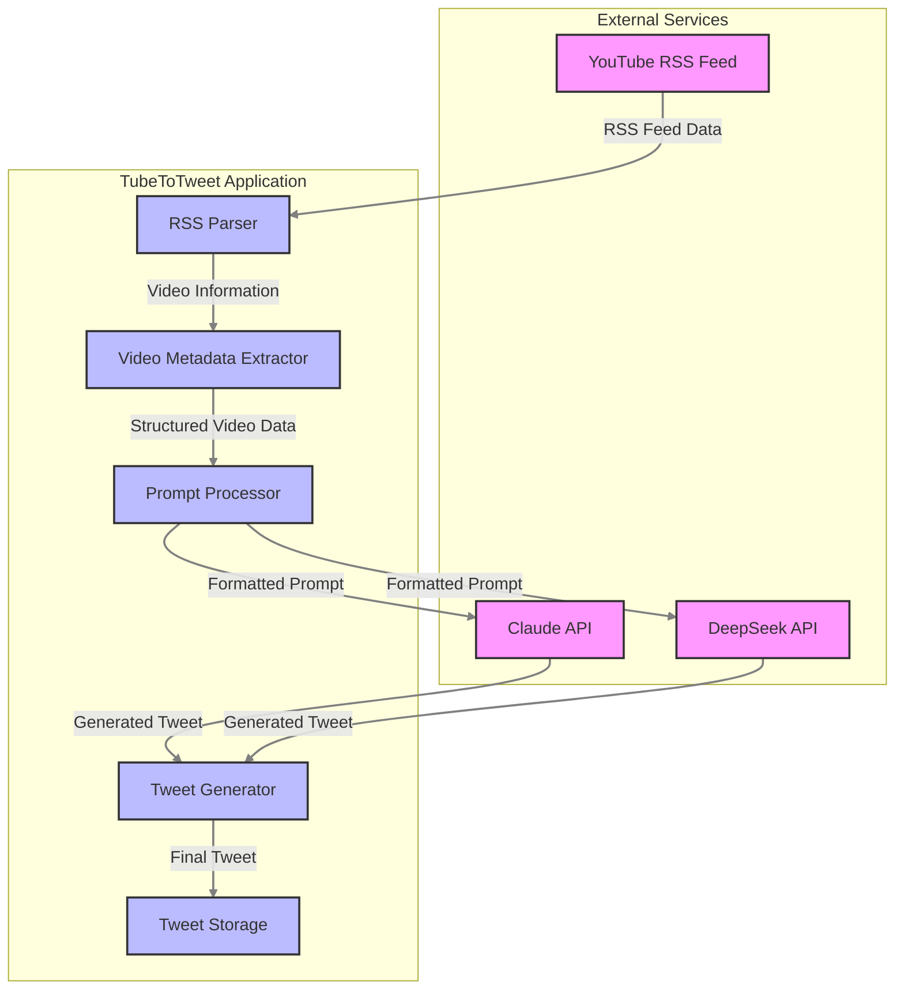

# TubeToTweet Data Flow

This document visualizes the data flow within the TubeToTweet application.

## System Architecture

## Component Description

1. **YouTube RSS Feed**
   - Source of video data
   - Provides latest video information from specified channel

2. **RSS Parser**
   - Processes raw RSS feed
   - Extracts relevant video metadata

3. **Video Metadata Extractor**
   - Structures video information
   - Prepares data for prompt generation

4. **Prompt Processor**
   - Formats video data into AI-ready prompts
   - Handles prompt templates and variations

5. **AI Services (Claude/DeepSeek)**
   - Generate engaging tweet content
   - Process structured prompts

6. **Tweet Generator**
   - Finalizes tweet format
   - Applies character limits and formatting

7. **Tweet Storage**
   - Maintains history of generated tweets
   - Prevents duplicate content

## Data Flow Steps

1. Application fetches latest videos from YouTube RSS feed
2. RSS parser extracts relevant video information
3. Metadata extractor structures the video data
4. Prompt processor prepares AI-ready prompts
5. AI services generate tweet content
6. Tweet generator finalizes the tweet
7. Generated tweet is stored for reference

## Environment Variables

The application relies on the following environment variables:
- `YOUTUBE_CHANNEL_ID`: Target YouTube channel
- `CLAUDE_API_KEY`: Authentication for Claude API
- `DEEPSEEK_API_KEY`: Authentication for DeepSeek API 